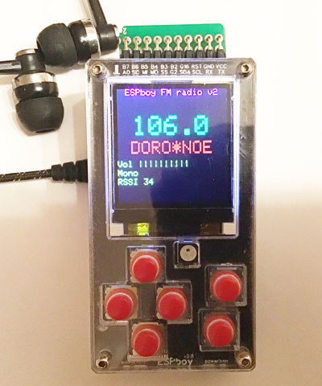
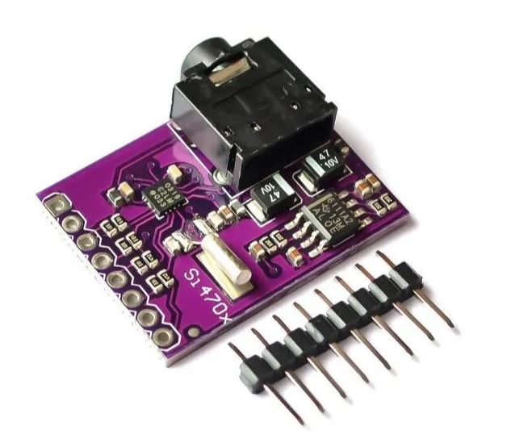
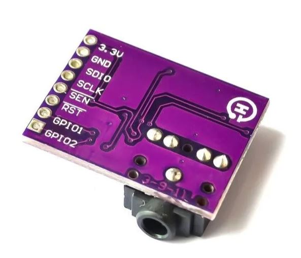

# ESPboy_FMradio

[Demo video](https://www.youtube.com/watch?v=kW6u79mBG4U)

The ESPboy FMradio extension module uses [Si4703 chip](https://aliexpress.ru/wholesale?SearchText=Si4703) and turning your ESPboy into portable FM radio.

## 1. Buy Si4703 module

[Purple](https://aliexpress.ru/wholesale?SearchText=Si4703)

## 2. Connect Si4703 to ESPboy

- 3.3v >> VCC
- GND >> GND
- SDIO >> D2, GPIO4, SDA
- SCLK >> D1, GPIO5, SCL
- SEN >> FREE
- RST >> RST
- GPIO1 >> FREE
- GPIO2 >> FREE

## 3. Upload this firmware

NOTE: Before compilation, set Arduino IDE settings

-  Board:  ESP8266 WeMos D1 mini
-  CPU frequency: 160Mhz

## 4. Useful links

- [Buy ESPboy](https://www.tindie.com/products/23910/)
- [DIY ESPboy](https://easyeda.com/ESPboy)
- [Main Web site](https://www.espboy.com)
- [YouTube channel](https://www.youtube.com/c/ESPboy)
- [Community](https://community.espboy.com)
- [Discord chat](https://discord.gg/kXfDQpX)
- [Twitter](https://twitter.com/ESPboy_edu)
- [Software](https://github.com/ESPboy-edu)
- [Contact: espboy.edu@gmail.com](mailto:espboy.edu@gmail.com)

